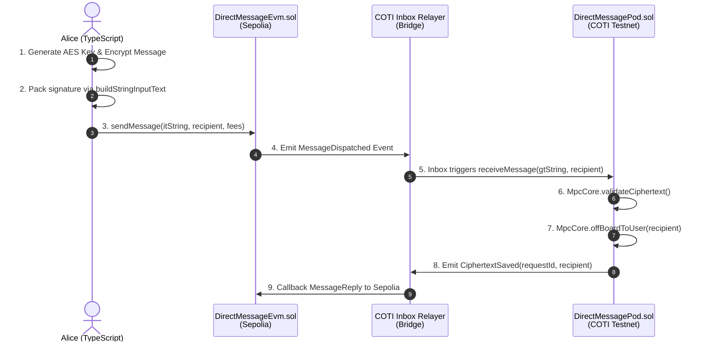

# DirectMessage architecture: Sepolia ↔ COTI Pod

This document provides a comprehensive architectural overview of the `DirectMessage` demonstration, covering the contracts, scripts, and network bridge flow between the EVM (Sepolia) and the Privacy-Preserving Layer (COTI V2 Testnet).

## Architecture Flow

The DirectMessage DApp utilizes the COTI V2 cross-chain MPC architecture. The flow involves a user encrypting a message off-chain, dispatching it to an EVM contract, which is then picked up by relayer nodes and delivered to a COTI-side "Pod" contract where the garbled ciphertext is securely validated and off-boarded explicitly for the recipient.

## Deployed Contracts

| Network | Contract Name | Contract Address | Purpose |
| :--- | :--- | :--- | :--- |
| **Sepolia** (EVM) | `DirectMessageEvm` | [`0xfA56400cebf6dfBEa5fBB0A13ce17Eb1017Aa156`](https://sepolia.etherscan.io/address/0xfA56400cebf6dfBEa5fBB0A13ce17Eb1017Aa156) | User-facing entry point. Receives the `itString` input and forwards it to the Inbox relayer. |
| **COTI Testnet** | `DirectMessagePod` | [`0xDe6466c5C7B81d995C18B2a57036Bc7a6857a1e8`](https://testnet.cotiscan.io/address/0xDe6466c5C7B81d995C18B2a57036Bc7a6857a1e8) | Privacy execution hub. Validates the signature and off-boards the garbled text into the recipient's cipher state. |

## Technical Implementation Files

### 1. Smart Contracts
- **`contracts/examples/DirectMessageEvm.sol` (Not explicitly tracked in current folder but implies EVM-side logic)**
  Handles the native EVM user interaction. Allows users to attach native ETH (msg.value) to pay the COTI Relayer's gas fees and callback fees.
- **`contracts/examples/DirectMessagePod.sol`**
  Handles the MPC (Multi-Party Computation) side.
  *Key Security mechanism:* `MpcCore.offBoardToUser(message, recipient)`. This ensures that *only* the specific recipient's AES Key can natively decrypt `getMessage(requestId)`. 

### 2. Interaction Scripts

#### `scripts/deploy_evm.ts` & `scripts/deploy_pod.ts`
Standalone Hardhat scripts required to deploy the counterpart pair across two different RPCs.
- `deploy_evm.ts`: Targets `--network sepolia`.
- `deploy_pod.ts`: Targets `--network cotiTestnet`. (Binds `DirectMessagePod` to the COTI MPC Executor relayer `0xC76aaE4F3810fBBd5d96b92DEFeBE0034405Ad9c`).

#### `scripts/interact_dm.ts`
The primary script for users sending the cross-chain private message.
*Command:* `npx hardhat run scripts/interact_dm.ts --network sepolia`

**Crucial Technical Caveat located in this script:**
To pass an `itString` cross-chain, you *cannot* merely pass raw ciphertext. 
The COTI MPC network rigidly blocks replay-attacks by demanding that the `itString` carries a signature array validating:
1. User's Network AES Key.
2. The exact COTI destination address (`DirectMessagePod`).
3. The exact Function Selector being called on COTI (e.g., `0x0928a471` for `receiveMessage()`).

*Fix implemented in SDK:* Replaced `CotiPodCrypto.encrypt` with `@coti-io/coti-sdk-typescript`'s `buildStringInputText` which constructs the proper cross-chain signature array binding the payload explicitly to `DirectMessagePod`.

#### `scripts/read_dm.ts` (or `scripts/check_final.ts`)
Queries the COTI network native RPC for the emitted `CiphertextSaved` event or reads the target output via the `getMessage(msgId)` function. It then leverages the recipient's account AES key natively to decrypt the final stored `ctString` payload.

## Key Takeaways for DApp Builders
1. **Cross-Chain Separation:** Only COTI nodes can execute `MpcCore` logic. The Sepolia contract operates purely as an Inbox trigger.
2. **Signature Packing:** Cross-chain messaging into COTI V2 absolutely requires bound signatures (`buildStringInputText` / `buildUintInputText`) instead of raw ciphertexts; otherwise, `MpcCore.validateCiphertext()` reverts silently on the MPC network resulting in no state updates.
3. **Fee Buffering:** `msg.value` on the Sepolia side dictates relayer success. Undershooting leaves transactions stranded. Use `InboxFeeManager` methods (`calculateTwoWayFeeRequiredInLocalToken`) plus a healthy +20-50% buffer to prevent gas execution drops across networks.
